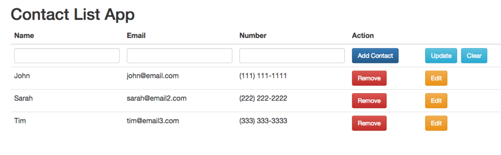

<h2>MEAN Stack RESTful API Tutorial - Contact List App</h2>

This repo contains the code for a RESTful API Contact List App that was built using the MEAN stack:

<ul>
	<li>MongoDB</li>
	<li>Express</li>
	<li>AngularJS</li>
	<li>NodeJS</li>
</ul>

<h3>Instructions</h3>

install the Node modules with

    npm install

then make sure MongoDB is running with

    mongod

from your MongoDB directory, and then run the code with 

    node server

You might see a message that says, 

    Error: Module did not self-register.]
    js-bson: Failed to load c++ bson extension, using pure JS version
    
Don't worry about this; the code will still work.

<h3>Have fun!</h3>

If you have any questions, feel free to leave a comment and I will try to help if I can!
